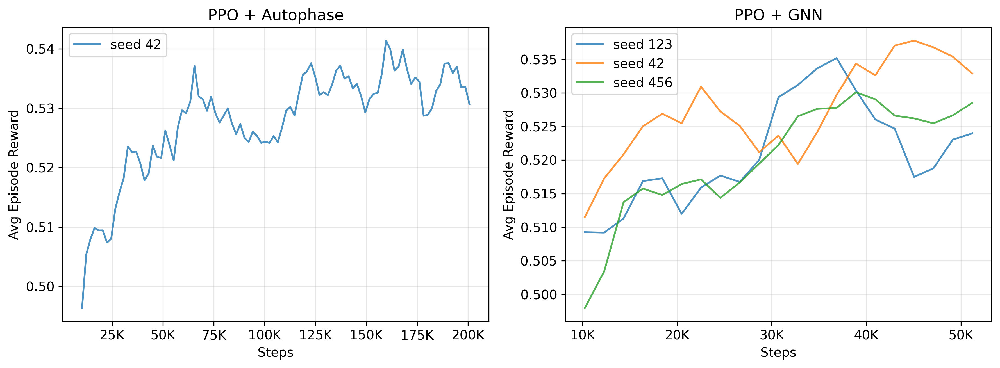
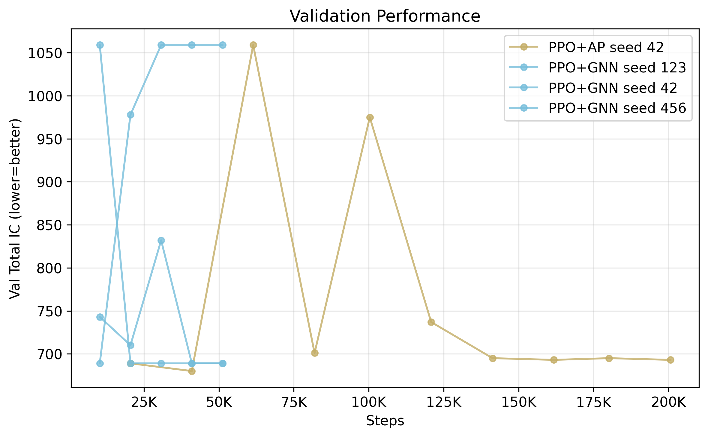

# GNN-Based LLVM Pass Ordering with Reinforcement Learning

## Overview

This project trains reinforcement learning agents to optimize LLVM compiler pass orderings for code size reduction. Instead of applying a fixed optimization sequence (like `-O3`), our agents learn **program-specific** pass orderings that outperform standard compiler optimization levels.

We compare two approaches:
- **PPO + Autophase**: PPO agent using a flat 56-dimensional feature vector (instruction type counts)
- **PPO + GNN**: PPO agent using a GraphSAGE neural network that operates directly on the program's control flow and data flow graph structure

### Key Finding

The GNN-based agent matches the flat-feature agent's validation performance (689 vs 680 total IC) while requiring **75% fewer training steps** and **less than half the training benchmarks**, demonstrating that structural graph representations are more data-efficient for learning compiler optimization strategies.

## Results

| Method | Val Total IC | Val Reduction | Training Steps | Training Benchmarks |
|--------|-------------|---------------|----------------|---------------------|
| -O3 (baseline) | ~700 | ~48% | — | — |
| PPO + Autophase | **680** | **50.1%** | 200K | 9 |
| PPO + GNN | **689** | **49.4%** | 50K | 4 |

Both RL agents significantly outperform the fixed `-O3` pass sequence across validation benchmarks (crc32, qsort, stringsearch2).

### Training Curves



### Validation Performance



## Architecture

### PPO + Autophase
```
Program → Autophase (56-dim vector) → Policy MLP → Action (pass selection)
                                    → Value MLP → State value
```

### PPO + GNN (Novel Contribution)
```
Program → LLVM IR → Custom IR Parser → CFG+DFG Graph → GraphSAGE Encoder → 128-dim embedding
                                                                          → Policy MLP → Action
                                                                          → Value MLP → Value
```

The custom IR parser extracts:
- **Instruction nodes** with opcode features (57 LLVM opcodes)
- **Control flow edges** (intra-block sequential + cross-block branches)
- **Data flow edges** (SSA def-use chains)

## Repository Structure

```
compiler-opt/
├── configs/
│   ├── benchmarks.yaml          # Train/val/test split (14/5/4)
│   ├── hyperparams.yaml         # All hyperparameters
│   └── passes.yaml              # Reduced action space (36 passes)
│
├── src/
│   ├── agents/
│   │   ├── base_agent.py        # Abstract base class
│   │   ├── greedy.py            # Greedy search baseline
│   │   ├── ppo_autophase.py     # PPO + flat features
│   │   └── ppo_gnn.py           # PPO + GNN encoder
│   ├── features/
│   │   ├── autophase.py         # 56-dim Autophase extraction
│   │   └── programl.py          # Custom LLVM IR → PyG graph parser
│   ├── models/
│   │   ├── policy_mlp.py        # Policy network
│   │   ├── value_head.py        # Value network
│   │   └── gnn_encoder.py       # GraphSAGE encoder
│   └── envs/
│       └── compiler_env.py      # CompilerGym wrapper
│
├── scripts/
│   ├── discover_benchmarks.py   # Step 1: Validate all cBench benchmarks
│   ├── run_full_baselines.py    # Step 2: O0/O3/Oz/Greedy/Random baselines
│   ├── profile_action_space.py  # Step 3: Per-pass profiling → reduced action space
│   ├── train_ppo_autophase.py   # Step 4: Train PPO + Autophase
│   ├── train_ppo_gnn.py         # Step 5: Train PPO + GNN
│   ├── evaluate_all.py          # Step 6: Test set evaluation
│   └── generate_figures.py      # Step 7: Generate paper figures
│
├── data/
│   ├── benchmark_inventory.json # 23 valid cBench benchmarks
│   └── pass_profiles.json       # Per-pass improvement data
│
├── results/
│   ├── full_baselines.json      # All baseline results
│   ├── ppo_autophase/           # Checkpoints + training logs
│   ├── ppo_gnn/                 # Checkpoints + training logs
│   └── figures/                 # Generated figures (PNG)
│
└── requirements.txt
```

## Methodology

### 1. Benchmark Discovery
Validated all 23 cBench-v1 benchmarks for `reset()` and `fork()` support in CompilerGym v0.2.5. All 23 passed.

### 2. Benchmark Split
Stratified split by program category:
- **Train (14)**: adpcm, gsm, blowfish, rijndael, bzip2, jpeg-c, dijkstra, bitcount, ispell, stringsearch, susan, tiff2bw, tiffdither, ghostscript
- **Validation (5)**: lame, crc32, qsort, stringsearch2, tiffmedian
- **Test (4)**: sha, jpeg-d, patricia, tiff2rgba

### 3. Action Space Reduction
Profiled all 124 LLVM passes individually on training benchmarks. Found **36 passes** that improve at least one benchmark, covering 100% of observed single-pass improvements. Top passes: `sroa`, `mem2reg`, `early-cse-memssa`, `newgvn`, `gvn`, `instcombine`.

### 4. Baselines
Collected O0, O3, Oz, Greedy (45-step), and Random (50×50) baselines across all 23 benchmarks. Greedy beats O3 by **6-8%** on average.

### 5. RL Training
- **PPO + Autophase**: 200K steps on 9 benchmarks (IC < 20K), ~37 min
- **PPO + GNN**: 50K steps on 4 benchmarks (IC < 3K), ~28 min per seed
- Both use reduced 36-pass action space, clip ratio 0.2, GAE λ=0.95

### 6. Custom IR Parser
The `programl` Python package was incompatible with our environment, so we built a custom LLVM IR parser (`src/features/programl.py`) that extracts control flow and data flow graphs directly from IR text, producing PyTorch Geometric `Data` objects with:
- One-hot opcode node features (57 opcodes)
- CFG edges (sequential + branch targets)
- DFG edges (SSA def-use chains)

## Setup

### Prerequisites
- Python 3.10
- Ubuntu 22.04 (WSL2 or native)

### Installation
```bash
# Create virtual environment
python3.10 -m venv venv
source venv/bin/activate

# Install dependencies (order matters)
pip install "pip<24.1" setuptools==65.5.0 wheel==0.38.4
pip install gym==0.21.0
pip install compiler-gym==0.2.5 "numpy<2" pyyaml tqdm scipy matplotlib
pip install torch --index-url https://download.pytorch.org/whl/cpu
pip install torch-geometric

# Fix missing library (Ubuntu 22.04)
sudo apt-get install -y libtinfo5
```

### Reproduce Results
```bash
# Step 1: Discover benchmarks
python scripts/discover_benchmarks.py

# Step 2: Collect baselines (~3 hours)
python scripts/run_full_baselines.py

# Step 3: Profile action space (~15 min)
python scripts/profile_action_space.py

# Step 4: Train PPO + Autophase (~37 min per seed)
python scripts/train_ppo_autophase.py --seed 42

# Step 5: Train PPO + GNN (~28 min per seed)
python scripts/train_ppo_gnn.py --seed 42

# Step 6: Generate figures
python scripts/generate_figures.py
```

## Technical Details

### Hyperparameters
| Parameter | Value |
|-----------|-------|
| PPO clip ratio | 0.2 |
| GAE lambda | 0.95 |
| Entropy coefficient | 0.01 |
| Learning rate | 3e-4 (cosine annealing) |
| Batch size | 64 |
| PPO epochs | 4 |
| Max episode steps | 45 |
| GNN layers | 3 (GraphSAGE, mean aggregation) |
| GNN hidden dim | 128 |
| Policy/Value MLP | 2 layers × 256 hidden |

### Dependencies
| Package | Version | Purpose |
|---------|---------|---------|
| compiler_gym | 0.2.5 | LLVM optimization environment |
| torch | >=2.0 | Neural network training |
| torch_geometric | >=2.4 | GNN layers (GraphSAGE) |
| numpy | 1.26.x | Numerical operations |
| scipy | >=1.11 | Statistical tests |
| matplotlib | >=3.9 | Figure generation |
| pyyaml | >=6.0 | Config loading |

## Future Work
- Extended GNN training budget on larger benchmarks
- Polybench cross-suite generalization testing
- Pass sequence analysis (transition matrices, n-gram patterns)
- Runtime measurement on actual hardware (RISC-V)
- Execution time optimization in addition to code size

## Author
Dimitrije Pesic — Faculty of Electrical Engineering, University of Belgrade