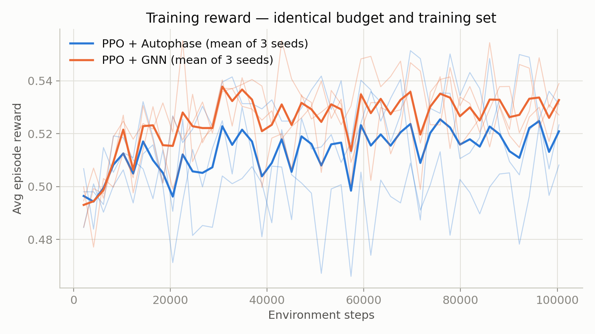
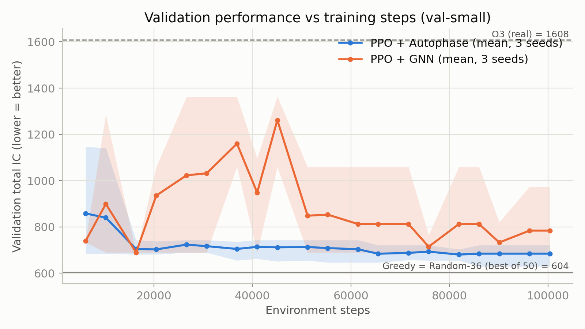
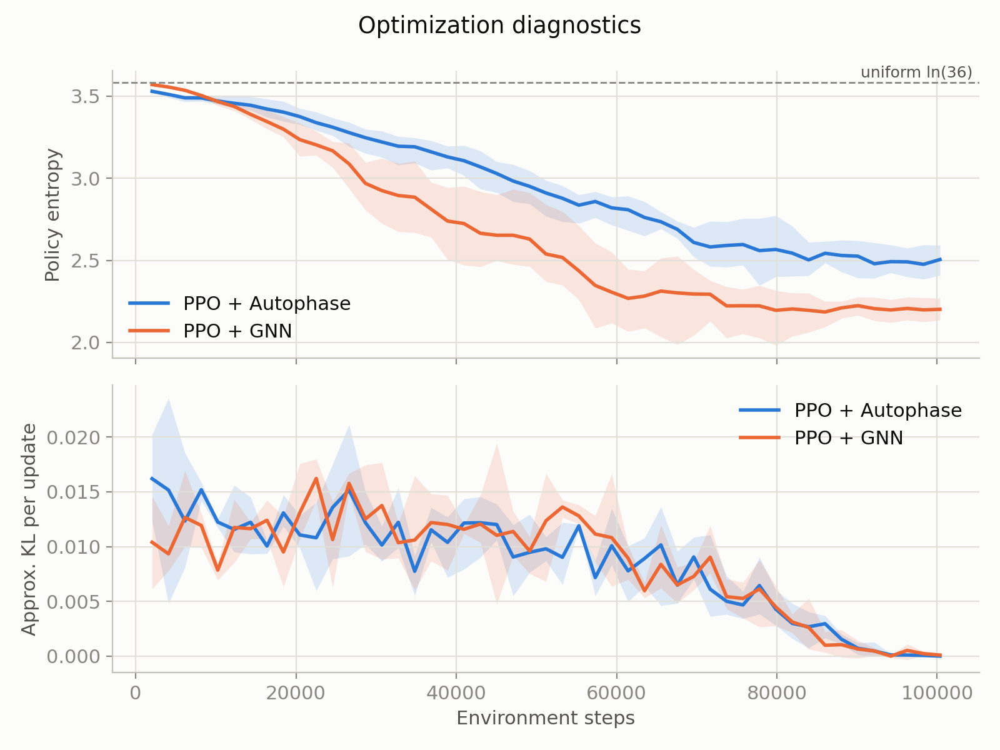
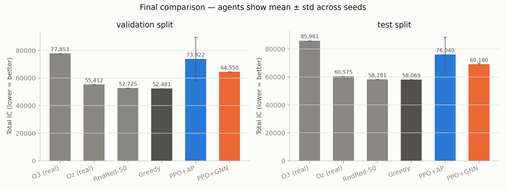

# GNN vs. Flat Features for LLVM Pass Ordering with RL: A Controlled Study

## Overview

This project trains reinforcement-learning agents to choose LLVM optimization
pass orderings that minimize IR instruction count (IC), and asks a specific
question under a controlled protocol:

> Does a GraphSAGE encoder over the program's control-flow + data-flow graph
> make PPO more data-efficient than the flat 56-dim Autophase feature vector?

**Answer, under this protocol: no.** The two representations are statistically
indistinguishable on both validation and test splits (Wilcoxon p = 0.63 / 0.88),
the GNN costs ~17× more wall-clock per environment step, and most of the
end-to-end IC reduction is attributable to the curated 36-pass action space
rather than to learning. An earlier version of this README claimed the
opposite; see [What changed and why](#what-changed-and-why).

## Controlled protocol

Everything that differs between the two agents is the state representation.

| Protocol element | Value (identical for both agents) |
|---|---|
| Training benchmarks | dijkstra, adpcm, bitcount, stringsearch (cBench-v1, O0 IC < 3000) |
| Budget | 100K env steps per seed |
| Seeds | 42, 123, 456 (3 per agent) |
| Checkpoint selection | val-small (crc32, qsort, stringsearch2) every 5K steps |
| Final evaluation | full validation split (5) + held-out test split (4), once, from best checkpoints |
| Action space | 36 passes (profiled subset of 124) |
| PPO | clip 0.2, GAE λ=0.95, γ=0.99, KL early-stop (target 0.02), entropy coeff 0.01→0.001 |

Null models measured in the same 36-pass space: a single random 45-step
episode (mean of 20), and best-of-50 random episodes.

## Results

Total IC, lower is better. `-O3`/`-Oz` are the **real** optimization levels
(CompilerGym `IrInstructionCountO3/Oz` observations), not hand-picked pass
lists. Agents report the median seed; mean ± std across seeds in parentheses.

| Method | Validation (5) | Test (4) |
|---|---|---|
| O0 | 111,758 | 120,684 |
| -O3 (real) | 77,853 | 85,981 |
| -Oz (real) | 55,412 | 60,575 |
| Random search, full 124-pass space (50×50) | 59,572 | 63,938 |
| Random single episode, 36-pass space | 56,229 | 62,436 |
| **Random search, 36-pass space (50×45)** | **52,725** | **58,281** |
| **Greedy search** | **52,481** | **58,069** |
| PPO + Autophase | 64,837 (73,922 ± 15,724) | 68,922 (76,040 ± 12,439) |
| PPO + GNN | 64,568 (64,550 ± 25) | 68,620 (69,180 ± 792) |

In-training validation (val-small; best per seed; nulls: Oz 643,
random-1-episode 640, greedy = random-50 604):

| Agent | seed 42 | seed 123 | seed 456 |
|---|---|---|---|
| PPO + Autophase | 685 | 681 | **629** |
| PPO + GNN | 689 | 689 | 689 |

### Findings

1. **The curated action space, not RL, does the heavy lifting.** Best-of-50
   random search inside the 36-pass space matches greedy search (within 0.5%)
   and beats -Oz by ~5% on both splits. A *single* random episode already
   roughly matches -Oz. The 36-pass profiling step distills most of the
   available signal.

2. **GNN ≠ more data-efficient — the representations are indistinguishable.**
   With identical data, budget, and PPO loop, per-benchmark ICs differ
   insignificantly (Wilcoxon p = 0.625 validation, p = 0.875 test). The GNN's
   striking seed-consistency (std 25 vs 15,724) is not learned structure: all
   three GNN seeds converge to the same near-uniform-policy plateau (689 on
   val-small — the same value a barely-trained policy reaches).

3. **Neither representation generalizes across program scale.** Trained on
   programs with < 3,000 instructions, both agents underperform even a single
   random 36-pass episode on the 50K-60K-instruction validation/test programs.
   A deterministic argmax rollout transfers a degenerate behavior; random
   sampling is more robust on out-of-scale inputs.

4. **Learning is possible but fragile.** With the fixed PPO loop
   (truncation-aware GAE, KL early-stop), Autophase seed 456 genuinely
   learned: 629 on val-small, beating -Oz (643) and the single-episode null
   (640), approaching greedy (604). One seed in three; no GNN seed did.

5. **-O3 is the wrong yardstick for code size.** On the three small validation
   programs real -O3 *increases* IC above O0 (1,608 vs 1,362 — inlining and
   unrolling). Any size result advertised as "beats -O3" should be read as
   "beats a speed-oriented baseline at a size game." The honest compiler
   baseline is -Oz, and no learned policy here beats it on the full splits.

6. **The GNN pays ~17× wall-clock per step** (51-68 min vs 3 min per 100K
   steps), dominated by IR→graph extraction, despite an on-disk graph cache.

### What changed and why

The original README reported that both agents "significantly outperform -O3"
(~50% vs ~48% reduction) and that the GNN "matches Autophase with 75% fewer
training steps." Re-examination showed: the "-O3" baseline was a hand-crafted
15-pass list; its own recorded value (644 on the 3-benchmark validation
subset) *beat* both agents (680/689); the agents' best scores were reached
within 10-40K steps, not at their nominal budgets; the two agents trained on
different benchmark sets; and the test split had never been evaluated. All
claims were re-derived from a controlled rerun with fixed code. The original
artifacts are preserved in `results/archive_2026-04_original/`.

Fixes applied before the rerun (all in this repo's history):

- **PPO**: GAE now bootstraps V(s_next) at truncations (episodes here never
  truly terminate) and no longer leaks advantages across episode boundaries at
  rollout cuts; KL-based epoch early stopping; linear entropy-coefficient
  decay; lower encoder learning rate for the GNN stack.
- **GNN**: edge-type-aware GraphSAGE (separate CFG/DFG convolutions per
  layer — `edge_type` was previously computed and ignored); node features
  extended with is-terminator / operand-count / defines-value / is-memory-op
  scalars; versioned graph cache.
- **Baselines**: real -O3/-Oz observations; random null models in the reduced
  action space; all baselines recorded per benchmark in
  `results/full_baselines_v2.json`.
- **Evaluation**: `scripts/evaluate_all.py` now actually runs (test split was
  previously never evaluated) and reports per-seed results, bootstrap CIs and
  a paired Wilcoxon test; `scripts/generate_figures.py` (referenced but
  missing before) exists.

## Figures






## Repository structure

```
compiler-opt/
├── configs/
│   ├── benchmarks.yaml          # Fixed train/val/test split + val-small subset
│   ├── hyperparams.yaml         # Controlled-protocol hyperparameters
│   └── passes.yaml              # Reduced 36-pass action space
├── src/
│   ├── agents/ppo_autophase.py  # PPO + flat Autophase features
│   ├── agents/ppo_gnn.py        # PPO + GraphSAGE encoder
│   ├── features/autophase.py    # 56-dim feature extraction
│   ├── features/programl.py     # Custom LLVM IR → PyG graph parser + cache
│   └── models/                  # policy_mlp, value_head, gnn_encoder
├── scripts/
│   ├── setup_wsl_env.sh         # One-time environment setup (WSL/Ubuntu 22.04)
│   ├── run_experiment.sh        # Full pipeline: baselines → training → eval → figures
│   ├── augment_baselines.py     # Real O3/Oz + random-in-reduced-space nulls
│   ├── train_ppo_autophase.py   # --seed N
│   ├── train_ppo_gnn.py         # --seed N
│   ├── evaluate_all.py          # Final eval: full val + test, stats
│   └── generate_figures.py      # fig1-fig4
├── data/                        # benchmark inventory, pass profiles
└── results/
    ├── full_baselines_v2.json   # All baselines incl. real O3/Oz + nulls
    ├── final_evaluation.json    # Per-seed final results + statistics
    ├── ppo_autophase/, ppo_gnn/ # Checkpoints + training logs (3 seeds each)
    ├── figures/
    └── archive_2026-04_original/  # Pre-rerun artifacts, kept for provenance
```

## Reproduce

Linux (or WSL2 Ubuntu 22.04) required — CompilerGym 0.2.5 is Linux-only.

```bash
bash scripts/setup_wsl_env.sh     # venv + pinned deps + smoke test (~10 min)
bash scripts/run_experiment.sh    # baselines + 6 trainings + eval + figures
```

Wall-clock on a laptop CPU: baselines ~35 min, PPO+Autophase ~3 min/seed,
PPO+GNN ~50-70 min/seed, final evaluation ~15 min.

## Honest limitations & where a GNN could still win

- Deterministic argmax rollouts are brittle; sampling-based evaluation (e.g.
  best-of-k samples) would measure the policy distribution, not its mode.
- Training only on < 3K-IC programs is the protocol's control, but also its
  limit: the scale-generalization failure might shrink with mixed-size
  training (the GNN's per-step cost is what made that expensive here).
- The GNN receives opcode-level features only; no pretraining, no value/type
  information, no global context beyond mean pooling. A pretrained encoder
  (e.g. on IR reconstruction or supervised proxy tasks) remains untested here.
- Single-rollout policies are the right product target (amortized search:
  greedy costs O(|A|) compilations per step, a policy costs one forward pass) —
  but to claim it, a policy must first reliably beat the single-episode random
  null on unseen programs. None here does.
