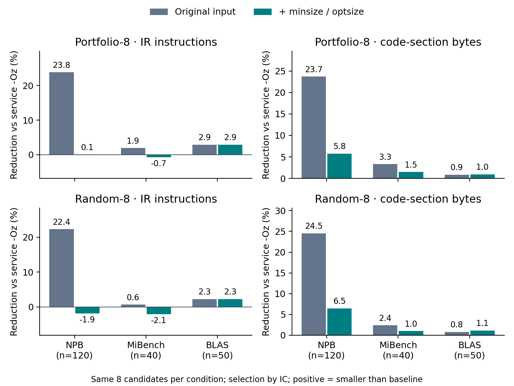

# Verified CompilerGym audit results

Complete paired matrix: **210 programs**, eight fixed portfolio sequences and eight paired random sequences per program, with and without function size attributes. No failed programs or candidates. All original O0/Oz counts and available portfolio candidate ICs reproduced exactly.

Positive gains mean smaller than that condition's service -Oz reference. The candidate is selected by final IC in every column; byte selection is not substituted. Each percentage is a reduction in summed costs, not the mean per-program reduction.

| Suite | Method | IC gain, original | IC gain, attributes | Code bytes gain, original | Code bytes gain, attributes |
|---|---|---:|---:|---:|---:|
| NPB (120) | portfolio-8 | +23.84% | +0.08% | +23.71% | +5.76% |
| NPB (120) | random-8 | +22.35% | -1.87% | +24.53% | +6.46% |
| MiBench (40) | portfolio-8 | +1.94% | -0.70% | +3.32% | +1.47% |
| MiBench (40) | random-8 | +0.62% | -2.06% | +2.39% | +1.00% |
| BLAS (50) | portfolio-8 | +2.89% | +2.89% | +0.87% | +0.95% |
| BLAS (50) | random-8 | +2.26% | +2.26% | +0.80% | +1.14% |

## Baseline changes and command-line diagnostics

| Suite | Service -Oz IC, original → attributes | Code bytes, original → attributes | Modules where CLI Oz IC differs from service, original / attributes |
|---|---:|---:|---:|
| NPB | 53,085 → 40,446 | 291,616 → 214,296 | 37 / 21 |
| MiBench | 4,841 → 4,714 | 27,791 → 25,629 | 8 / 4 |
| BLAS | 37,838 → 37,838 | 180,277 → 173,661 | 5 / 5 |

## Portfolio outcomes after adding attributes

| Suite | IC wins / ties / losses | Code-byte wins / ties / losses |
|---|---:|---:|
| NPB | 34 / 37 / 49 | 79 / 13 / 28 |
| MiBench | 12 / 20 / 8 | 11 / 13 / 16 |
| BLAS | 33 / 16 / 1 | 25 / 8 / 17 |

## Scope

This establishes the effect of size attributes in the original CompilerGym service protocol for these three suites. It does not establish equivalence to a full clang -Oz build, runtime improvement, semantic validation, a learned-policy result under the new protocol, or effects on unexamined papers. Random-8 uses one newly drawn seed; its old-protocol numbers need not match the paper's random samples. Related modules within a suite are not independent projects. See README.md for the full protocol.

Protocol fingerprint: `8db1604d49185a07ab80c58560d0608434f33c04a78e38931e5a924e6d52b539`.
