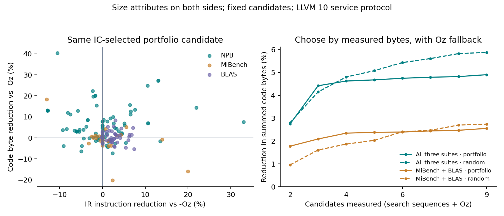

# Selection objective and concentration audit

Analysis of the frozen 210-program CompilerGym service matrix. All headline rows below use size attributes on both baseline and candidates, the original target per module, and the same eight recorded candidate sequences. No new search, fitting or compilation was performed.

Positive percentages mean reductions in summed pure code-section bytes. These are post-hoc, exact finite-cohort comparisons, not estimates of new-project performance.

## What changing the selector buys

| Cohort | Method | Choose by IC | IC, byte tie-break | Choose by bytes | Bytes + Oz fallback |
|---|---|---:|---:|---:|---:|
| NPB (120) | portfolio-8 | +5.76% | +5.88% | +6.80% | +7.09% |
| NPB (120) | random-8 | +6.46% | +6.51% | +8.45% | +8.80% |
| MiBench (40) | portfolio-8 | +1.47% | +1.61% | +2.82% | +3.13% |
| MiBench (40) | random-8 | +1.00% | +1.13% | +4.05% | +4.35% |
| BLAS (50) | portfolio-8 | +0.95% | +0.98% | +2.34% | +2.47% |
| BLAS (50) | random-8 | +1.14% | +1.14% | +2.33% | +2.50% |
| All three suites (210) | portfolio-8 | +3.48% | +3.56% | +4.68% | +4.90% |
| All three suites (210) | random-8 | +3.89% | +3.92% | +5.61% | +5.88% |
| MiBench + BLAS (90) | portfolio-8 | +1.02% | +1.06% | +2.40% | +2.55% |
| MiBench + BLAS (90) | random-8 | +1.12% | +1.14% | +2.55% | +2.74% |

The original IC rule resolves ties by sequence order. The intermediate selector changes only ties at minimum IC. Direct byte selection chooses the smallest measured code section among all eight candidates; it is optimal only within that recorded candidate pool.

Oz fallback chooses the baseline on byte ties as well as regressions. Its no-regression property is guaranteed by the selection rule for this measured size metric; it is not an empirical discovery or a runtime/correctness guarantee.

## Cost accounting

| Selector | Optimized IR candidates | Candidate code-generation measurements | Baseline for comparison/fallback |
|---|---:|---:|---|
| IC | 8 | 1, after selection | 1 additional baseline optimization and object measurement |
| IC, byte tie-break | 8 | Number of tied minimum-IC candidates | Same baseline |
| Bytes | 8 | 8 | Same baseline |
| Bytes + Oz fallback | 8 | 8 | Baseline may also be returned |

A deployment that tries eight sequences and Oz considers nine candidates. Equal numbers of IR sequences do not imply equal wall time: direct byte selection adds code generation. The existing audit timed whole program jobs under emulation; it cannot establish selector latency.

## Where IC and code disagree

The selected candidate is the original IC-minimum in both columns of each outcome pair.

| Cohort | Method | IC improves, code grows | IC grows, code improves | Byte selection helps | Tie-breaking alone helps |
|---|---|---:|---:|---:|---:|
| NPB | portfolio | 8 | 41 | 39 | 18 |
| NPB | random | 5 | 49 | 61 | 10 |
| MiBench | portfolio | 8 | 4 | 17 | 9 |
| MiBench | random | 5 | 7 | 23 | 6 |
| BLAS | portfolio | 14 | 1 | 35 | 4 |
| BLAS | random | 14 | 5 | 33 | 0 |
| All three suites | portfolio | 30 | 46 | 91 | 31 |
| All three suites | random | 24 | 61 | 117 | 16 |

## Concentration and sensitivity

Top five means the five largest positive savings under the IC selector, selected after observing outcomes. Both retained-cohort columns remove those same five modules. This is a stress test, not an unbiased robustness estimate. Shares of net savings may exceed 100% because regressions elsewhere cancel positive savings.

| Cohort | Method | Top five / net savings | Gain after omitting top five: IC selection | Same subset: byte selection |
|---|---|---:|---:|---:|
| NPB | portfolio | 38.5% | +4.11% | +5.29% |
| NPB | random | 45.0% | +3.95% | +6.14% |
| MiBench | portfolio | 178.8% | -1.70% | +0.06% |
| MiBench | random | 202.3% | -1.49% | +1.74% |
| BLAS | portfolio | 101.4% | -0.02% | +1.60% |
| BLAS | random | 84.1% | +0.25% | +1.50% |
| All three suites | portfolio | 33.0% | +2.51% | +3.79% |
| All three suites | random | 38.7% | +2.51% | +4.32% |
| MiBench + BLAS | portfolio | 97.4% | +0.03% | +1.59% |
| MiBench + BLAS | random | 80.7% | +0.27% | +1.75% |

## Fixed prefix budgets

The portfolio order was fixed on training data before this audit. Random prefixes use the already recorded draw order. No budget, ordering or sequence is selected using these results. Each cell uses byte selection and includes Oz as an additional candidate.

| Cohort | Method | 1 sequence + Oz | 3 + Oz | 8 + Oz |
|---|---|---:|---:|---:|
| NPB | portfolio | +3.65% | +6.74% | +7.09% |
| NPB | random | +4.52% | +7.53% | +8.80% |
| MiBench | portfolio | +2.65% | +2.77% | +3.13% |
| MiBench | random | +0.70% | +3.52% | +4.35% |
| BLAS | portfolio | +1.64% | +2.28% | +2.47% |
| BLAS | random | +0.99% | +1.62% | +2.50% |
| All three suites | portfolio | +2.74% | +4.62% | +4.90% |
| All three suites | random | +2.80% | +4.80% | +5.88% |
| MiBench + BLAS | portfolio | +1.77% | +2.34% | +2.55% |
| MiBench + BLAS | random | +0.95% | +1.87% | +2.74% |

## Limits

This is a diagnostic of a fixed candidate pool. Measuring the target cost and choosing its minimum is not proposed as a novel algorithm. One random draw set is insufficient to rank random search and the portfolio as general methods. There is no new test set, runtime measurement, semantic validation, retraining or GNN evaluation here. NPB modules are correlated; 120 modules do not represent 120 independent applications. All results concern relocatable code sections, not full firmware footprints or linked executables.

Input protocol fingerprint: `8db1604d49185a07ab80c58560d0608434f33c04a78e38931e5a924e6d52b539`.

Reproduce: `python3 scripts/analyze_cgym_selection.py` (matplotlib required for the figure).
